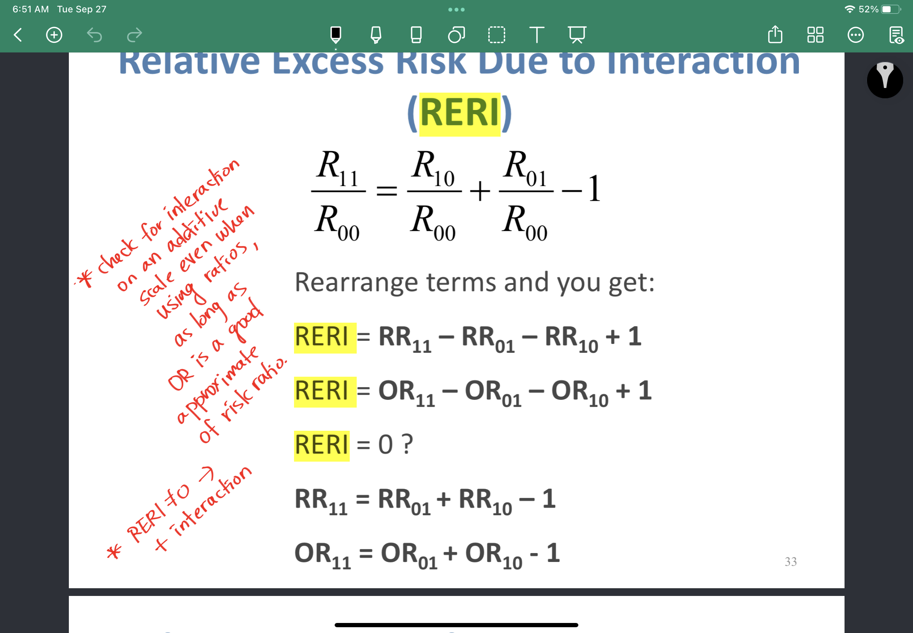

# This is Jeff's awesome website

What if I add some text here...?


# Here's a subsection

And here's some addition text ...

```{r}
rnorm(10)
```

# Links to other websites

Let's link to useful tools for data science:

* [Google](https://google.com/)
* [P8105](https://p8105.com)

# Local image (pick in repository)

Here's my cat, ted:




# Link to page w/in the site

[About me](about.html)

## Quarterly Rseults {.tabset}

### By product

my first tab

### By regions

## this is a new section

new


